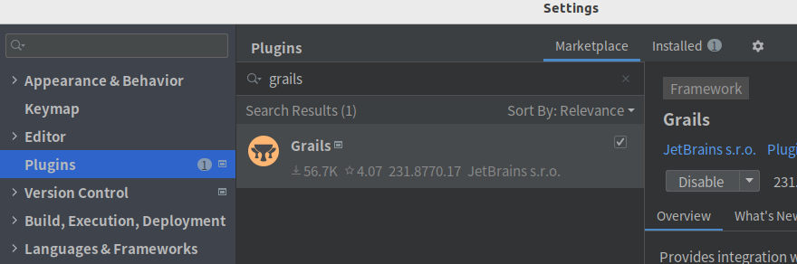
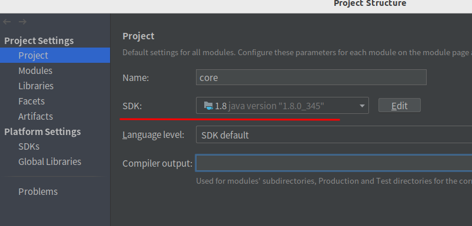
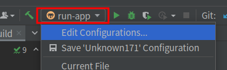
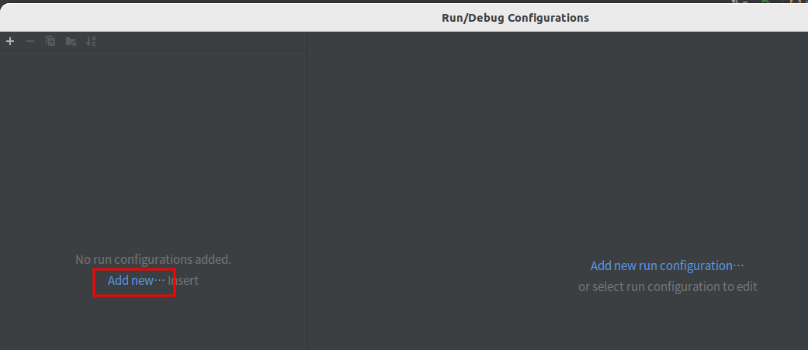
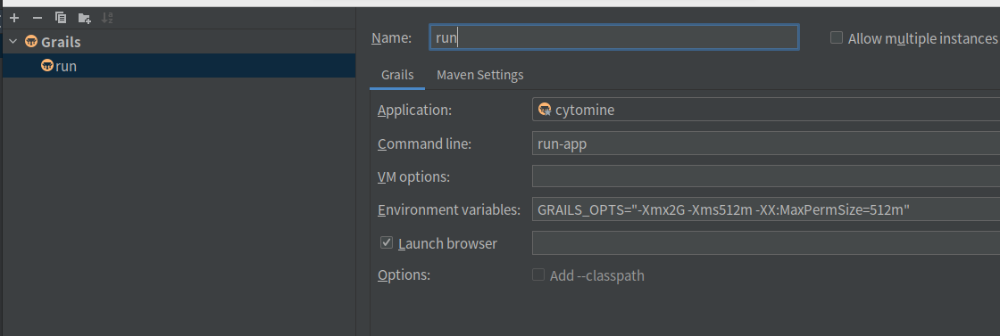
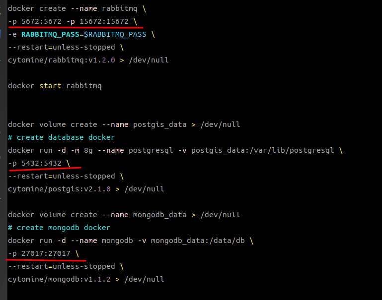
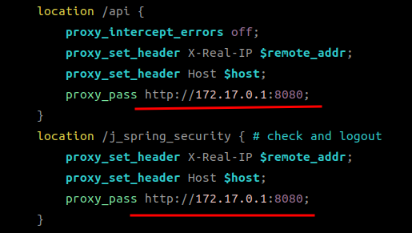
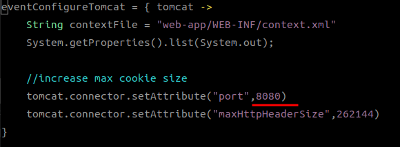
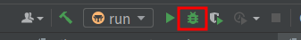

# Use IDEA debug cytomine-core

## Open the cytomine-core project in IDEA

### install Grails plugin
- From the menu bar, File->Setting->Plugins

    

### Set the project interpreter to openjdk8
- From the menu bar, go to File->Project Structure->Project Setting->project. Select SDK 1.8 (If SDK 1.8 is not available, click on Add SDK to add it)

    

### Download the Grails interpreter
```
$ mkdir -p $HOME/.grails/wrapper/2.4.4/
$ wget https://github.com/grails/grails-core/releases/download/v2.4.4/grails-2.4.4.zip -O /tmp/grails.zip
$ unzip /tmp/grails.zip -d $HOME/.grails/wrapper/2.4.4/
```

### Fix grails2.4.4 jvm bug
```
$ wget https://repo.spring.io/artifactory/libs-snapshot-local/org/springframework/springloaded/1.2.5.BUILD-SNAPSHOT/springloaded-1.2.5.BUILD-20151007.052706-4.jar -O /tmp/springloaded-1.2.1.RELEASE.jar
$ mv /tmp/springloaded-1.2.1.RELEASE.jar $HOME/.grails/wrapper/2.4.4/grails-2.4.4/lib/org.springframework/springloaded/jars/
```
### Set the Grails interpreter in IDEA
- Right-click the project folder -> Grails -> Configures Grails SDK -> Grail SDK Home: $HOME/.grails/wrapper/2.4.4/grails-2.4.4

### Configure the run command

- Click on the red box -> Edit Configurations



- Click on the red box ->Grails



- Configure as shown in the figure below




## Configure cytomine-bootstrap to debug the core
### Enter the cytomine-bootstrap project, switch to the master branch

- Open start_deploy.sh.sample, add the following 3 lines to expose the database and mq port to the local network
    
    

- Open configs/nginx/nginx.conf.sample, change all http://core:8080 to http://172.17.0.1:8080

    

- Add the following to /etc/hosts
```
127.0.0.1 localhost-core
127.0.0.1 localhost-upload
127.0.0.1 localhost-ims
127.0.0.1 localhost-ims2
127.0.0.1 postgresql
127.0.0.1 rabbitmq
127.0.0.1 mongodb
```
- Change tomcat port

  Change `Integer.parseInt(System.getProperty("server.port"))` to `8080` in scripts/_Events.groovy

  
- Execute the following commands to deploy cytomine
```
$ bash init
$ cp configs/core/cytomineconfig.groovy $HOME/.grails/
$ bash start
```


- Now you can debug the core in IDEA

    ]()