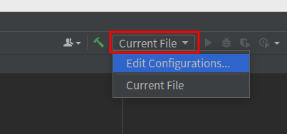
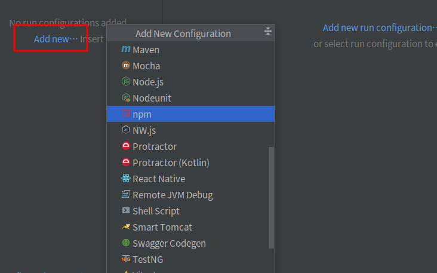
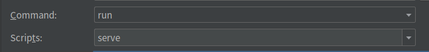
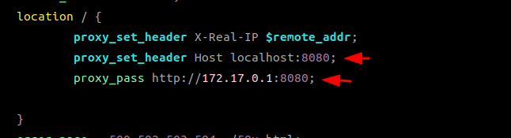
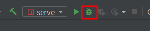

# Use IDEA debug cytomine-web_ui

## Open the cytomine project in IDEA

- Delete ```<meta http-equiv="Content-Security-Policy" content="upgrade-insecure-requests">``` from public/index.html
- run command
    ```
    $ sudo apt install npm
    $ npm install
    $ npm run translations-csv2json
    ```
### Configure the run command

- Click on the red box -> Edit Configurations



- Click on the red box -> npm



- Configure as shown in the figure below




## Configure cytomine-bootstrap to debug the web_ui
### Enter the cytomine-bootstrap project, switch to the master branch

- Open configs/web_ui/nginx.conf, change proxy_set_header and proxy_pass



- Add the following to /etc/hosts
```
127.0.0.1 localhost-core
127.0.0.1 localhost-upload
127.0.0.1 localhost-ims
127.0.0.1 localhost-ims2
```
- Execute the following commands to deploy cytomine
```
$ bash init
$ bash start
```
- Now you can debug the web_ui in IDEA

